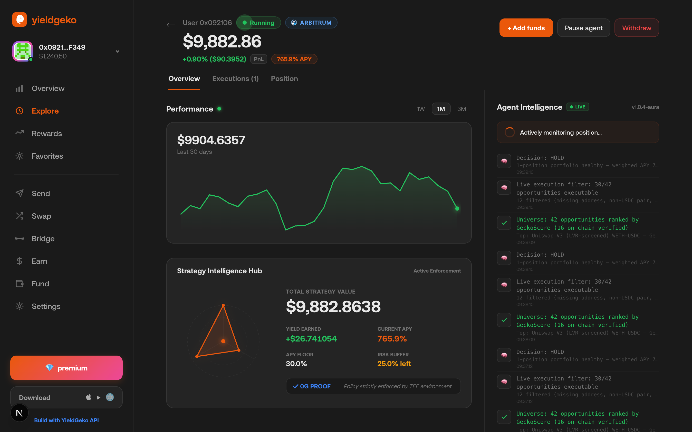

# YieldGeko

**DeFi yield optimization, fully autonomous — every allocation decision made inside a TEE, every proof anchored on 0G.**

**Live at [yieldgeko.com](https://yieldgeko.com)**

---

## Traction

YieldGeko is pre-launch and already has real demand signal — not projected, not fabricated.

| Signal | Number | Source |
|---|---|---|
| Waitlist (Twitter/X) | **500 users** | Organic — people who followed development updates and asked to be first in |
| Active beta testers | **10 users** | Invited cohort running live strategies with real capital |
| Proofs anchored on 0G Chain | **14** | `YieldGekoRegistry.totalAnchored()` — live, verify now |

### Community


YieldGeko has been building in public since day one. The community formed organically around one question people kept asking: *"when can I deposit?"*

### What beta testers are doing



> Real beta tester dashboard. Wallet `0x092106703adE19BF7a638AD371f8f6c25831F349`, running on Yieldgeko. Agent Intelligence sidebar shows live TEE decisions, 16 on-chain verified.

The 10 beta users are running live strategies on Arbitrum through the full stack — onboarding via ERC-4337 smart accounts, delegating to the agent via ERC-7710, and receiving real-time SSE-streamed proof updates as the agent rebalances. Each execution produces a verifiable proof bundle anchored on 0G Chain, which users can inspect at `/verify/:receiptHash`. The registry currently holds **14 anchored proofs**, each independently verifiable:

```bash
cast call 0xd7185a3Aa4b23EBE84e7bd60CF5e78B71dd21c8e \
  "totalAnchored()(uint256)" \
  --rpc-url https://evmrpc.0g.ai
# → 14
```

The 500-person waitlist formed organically from build updates posted on X — no paid promotion. The primary ask from followers was "when can I deposit?" — the strongest signal that the product solves a real problem.

### Why this matters for 0G

Every beta user and every waitlisted user who onboards generates:
- A 0G Storage upload per state snapshot (encrypted, CID-addressed)
- A 0G Compute inference per allocation decision (verifiable TEE)
- A 0G Chain anchor per execution (immutable registry entry)

At 500 users running weekly rebalances, that translates to thousands of verifiable 0G Compute + Storage operations per month — organic, recurring demand driven by real yield-seeking behaviour.

---

## The Problem

DeFi yields are opaque, volatile, and impossible to manage at scale. The best positions rotate across Uniswap V3, Aave, Morpho, and Pendle faster than any human can track — and impermanent loss silently destroys returns that APY numbers never advertise. Managing even a single concentrated liquidity position requires constant monitoring, rebalancing, and risk adjustment. At any meaningful capital level, this is a full-time job.

YieldGeko replaces that job with a verifiable autonomous agent: a system that continuously scores the yield universe, selects positions, executes on-chain, and proves every decision — using 0G's full stack for compute, storage, and chain anchoring.

---

## Architecture

```
┌─────────────────────────────────────────────────────────────┐
│                      YieldGeko Agent                        │
│                                                             │
│   ┌──────────────┐   ┌──────────────┐   ┌───────────────┐  │
│   │ Intelligence │   │  Execution   │   │  Proof Layer  │  │
│   │   Engine     │──▶│  Layer       │──▶│               │  │
│   │              │   │              │   │ 0G Storage    │  │
│   │ IL-first     │   │ ERC-4337 +   │   │ 0G Compute    │  │
│   │ GeckoScore   │   │ ERC-7710     │   │ 0G Chain      │  │
│   │ LVR screen   │   │ Arbitrum One │   │               │  │
│   └──────────────┘   └──────────────┘   └───────────────┘  │
│          ▲                                      │           │
│          │                                      ▼           │
│   DeFiLlama / Moralis              YieldGekoRegistry        │
│   30-day price history             (0G Mainnet, chain 16661)│
└─────────────────────────────────────────────────────────────┘
         ▲ SSE stream                     ▲ on-chain verify
         │                                │
    ┌────┴──────────────────┐    ┌─────────┴──────────┐
    │   Next.js Dashboard   │    │  /verify/:hash     │
    │   Live P&L, proofs    │    │  Public receipt    │
    └───────────────────────┘    └────────────────────┘
```

---

## 0G Stack Integration

### 0G Compute — Verifiable AI Yield Decisions

Every allocation decision routes through **DeepSeek V3 running inside Intel TDX + H100** via the 0G Compute Network. The agent constructs a structured prompt encoding the top-5 screened opportunities, the user's risk policy, and current portfolio state, then calls the TEE broker:

```typescript
// packages/agent/src/orchestrator/teeIntelligence.ts
const { createZGComputeNetworkBroker } = await import('@0gfoundation/0g-compute-ts-sdk');
const broker = await createZGComputeNetworkBroker(wallet, computeProviderAddress);
const [endpoint, model] = await broker.getServiceMetadata(computeProviderAddress);
const response = await broker.processRequest(endpoint, model, systemPrompt, userPrompt);
```

The broker returns an `attestCID` — a pointer to a blob in 0G Storage containing the TEE's `signerRaUrl` (Intel TDX hardware attestation) and `chatSignatureUrl` (enclave signature for this exact decision). Anyone can verify that the AI response originated inside the enclave by recovering the signing address from the RA report.

**Compute provider on 0G Mainnet:** `0x1B3AAef3ae5050EEE04ea38cD4B087472BD85EB0`  
**Model:** `deepseek/deepseek-chat-v3-0324`

---

### 0G Storage — Execution Traces & State Persistence

Every user state snapshot and execution trace is uploaded to 0G Storage using `@0gfoundation/0g-ts-sdk`. State is encrypted with AES-256-GCM before upload; the CID is stored locally as the recovery pointer.

```typescript
// packages/agent/src/orchestrator/persistence.ts
const memData = new MemData(Buffer.from(encryptedPayload));
const [tree] = await memData.merkleTree();
const cid = tree.rootHash();
await indexer.upload(memData, evmRpcUrl, managedSigner);
```

Execution traces (opportunity screener output, decision rationale, on-chain result) are uploaded as JSON artifacts. The resulting `traceCID` is the content address that gets anchored on 0G Chain.

---

### 0G Chain — Immutable Proof Anchoring

`YieldGekoRegistry` is deployed on **0G Mainnet (chain 16661)**. After every GENESIS, REBALANCE, HARVEST, or WITHDRAW, the agent calls `anchor()` to record a tamper-proof bundle:

```solidity
// contracts/contracts/YieldGekoRegistry.sol
function anchor(
    bytes32         receiptHash,
    address         userAddress,
    bytes32         strategyId,
    string calldata action,
    string calldata traceCID,    // 0G Storage CID for execution trace
    string calldata attestCID    // 0G Storage CID for TEE attestation blob
) external onlyAuthorised
```

The `ProofAnchored` event is indexed by `receiptHash`, `userAddress`, and `strategyId`, making every decision auditable with a single log query. The frontend's `/verify/:receiptHash` page decodes this event live from the 0G RPC, then reconstructs the full proof bundle from the two CIDs.

**YieldGekoRegistry:** `0xd7185a3Aa4b23EBE84e7bd60CF5e78B71dd21c8e` (0G Mainnet)

---

## Yield Intelligence Engine

The `yield-agent-core` package is a standalone intelligence layer built to score the full DeFi yield universe with IL-first pricing:

**GeckoScore breakdown (100 pts):**

| Factor | Weight | Rationale |
|---|---|---|
| IL Coverage | 30 pts | Predicted IL vs gross APY — positions that don't cover their own IL are penalised hard |
| Real Yield | 25 pts | Emission-stripped APY only; organic fee revenue |
| Stability | 15 pts | 30-day APY sigma and trend direction |
| Liquidity | 15 pts | TVL depth; positions must absorb capital without slippage |
| Diversification | 15 pts | Penalty for replicating existing portfolio exposure |

IL is computed from 30-day price histories using the closed-form formula:

```
r = priceRatio_t / priceRatio_0
IL = |2√r / (1+r) - 1|
```

Price histories are fetched from DeFiLlama coins API (same source used by the LVR screener), then cached to disk for zero-latency scoring on subsequent ticks.

**LVR Score** (`fee / LVR = feeTier / (σ²/8)`) is a continuous score factor rather than a hard gate — pools with poor fee-to-LVR ratios lose points but are not filtered out, allowing high-yield outliers to remain visible.

---

## On-Chain Execution

Execution uses **ERC-4337 smart accounts** (Pimlico bundler) combined with **ERC-7710 delegation** via MetaMask's Delegation Framework:

- `YieldGekoPolicyCaveatEnforcer` validates that every UserOp stays within the user's declared policy (max capital, allowed strategies, rebalance threshold)
- `YieldGekoExecutor` performs the actual protocol interactions
- `YieldGekoSwapper` handles token routing between positions

Withdrawals are non-blocking: the HTTP handler returns `202` immediately, the on-chain execution runs in a background process, and progress is streamed to the frontend via Server-Sent Events (`COLLECTING_FEES → CLOSING_POSITION → SWAPPING_TOKENS → COMPLETE`).

---

## Proof of Integrity

Every execution produces a four-part proof bundle visible to users and verifiable by anyone:

| Proof | Source | What it proves |
|---|---|---|
| **Arbitrum Tx** | Arbitrum One | On-chain execution actually happened |
| **0G Trace CID** | 0G Storage | Full screener output + decision rationale |
| **TEE Attestation CID** | 0G Storage | Intel TDX hardware attestation + enclave signature |
| **0G Chain Anchor** | 0G Mainnet Registry | Immutable record linking all three |

The verify page at `/verify/:receiptHash` reconstructs the full bundle by querying the registry contract directly — no backend, no trust required.

---

## Deployed Contracts

### 0G Mainnet (chain 16661)

| Contract | Address |
|---|---|
| YieldGekoRegistry | `0xd7185a3Aa4b23EBE84e7bd60CF5e78B71dd21c8e` |
| Compute Provider | `0x1B3AAef3ae5050EEE04ea38cD4B087472BD85EB0` |

### Arbitrum One (chain 42161)

| Contract | Address |
|---|---|
| YieldGekoPolicyCaveatEnforcer | `0x21b25E099CA7AF1BEa3a4558E437C56680B4b925` |
| YieldGekoExecutor | `0x94DE8790BEd6Be0395C6BE7f42FD677b7B8cBcFb` |
| YieldGekoSwapper | `0x4313539C4fF1b93891B6A66D6a2eb690153A1b33` |
| DelegationManager | `0xdb9B1e94B5b69Df7e401DDbedE43491141047dB3` |
| HybridDeleGator Impl | `0x48dBe696A4D990079e039489bA2053B36E8FFEC4` |

---

## Repository Structure

```
yieldgeko/
├── contracts/              Solidity — Registry (0G Chain) + Executor/Enforcer (Arbitrum)
├── frontend/               Next.js 15 — dashboard, strategy pages, /verify
├── packages/
│   ├── agent/              Node.js orchestrator — tick loop, proof service, SSE
│   ├── yield-agent-core/   Intelligence engine — GeckoScore, IL math, LVR screener
│   ├── provider/           Model provider metadata (Agentic ID)
│   └── core/               Shared types
```

---

## Setup & Run

### Prerequisites

- Node.js ≥ 20, pnpm ≥ 9
- Foundry (`foundryup`) for contract compilation
- A funded Arbitrum wallet (agent execution account)
- A funded 0G wallet (≥ 1 OG for compute + storage fees)

### 1. Install

```bash
git clone https://github.com/SeunOnTech/yieldgeko
cd yieldgeko
pnpm install
```

### 2. Configure the Agent

```bash
cp packages/agent/.env.local.example packages/agent/.env.local
```

| Variable | Description |
|---|---|
| `PRIVATE_KEY` | Agent wallet private key (signs 0G txs + Arbitrum UserOps) |
| `ARB_RPC_URL` | Arbitrum One RPC (e.g. Alchemy/Infura) |
| `RPC_URL` | 0G Mainnet RPC — `https://evmrpc.0g.ai` |
| `INDEXER_URL` | 0G Storage indexer — `https://indexer-storage-turbo-nl.0g.ai` |
| `ZG_REGISTRY_ADDRESS` | `0xd7185a3Aa4b23EBE84e7bd60CF5e78B71dd21c8e` |
| `ZG_COMPUTE_PROVIDER_ADDRESS` | `0x1B3AAef3ae5050EEE04ea38cD4B087472BD85EB0` |
| `ZG_COMPUTE_MODEL` | `deepseek/deepseek-chat-v3-0324` |
| `PIMLICO_API_KEY` | Pimlico bundler key (ERC-4337 sponsorship) |
| `AGENT_STATE_ENCRYPTION_KEY_B64` | 32-byte AES key (base64) for state encryption |
| `MORALIS_API_KEY` | Price history for IL scoring |

### 3. Configure the Frontend

```bash
cp frontend/.env.local.example frontend/.env.local
# Set NEXT_PUBLIC_AGENT_SSE_URL=http://localhost:3001/events
# Set NEXT_PUBLIC_PRIVY_APP_ID (from Privy dashboard)
```

### 4. Compile Contracts

```bash
cd contracts
forge build
```

### 5. Run (Development)

```bash
# Terminal 1 — Agent (SSE server on :3001)
cd packages/agent
pnpm dev

# Terminal 2 — Frontend (Next.js on :3000)
cd frontend
pnpm dev
```

### 6. Run (Production)

The agent is deployed to Google Cloud Run and the frontend to Vercel.

```bash
# Deploy agent to Cloud Run (builds via Google Cloud Build — no local Docker needed)
./deploy-agent.sh

# Deploy frontend to Vercel
cd frontend && vercel --prod
```

**Live agent endpoint:** `https://yieldgeko-agent-2qpw7tebfa-uc.a.run.app`

After deploying, set in Vercel:
```
NEXT_PUBLIC_AGENT_SSE_URL=https://yieldgeko-agent-2qpw7tebfa-uc.a.run.app/events
```

### 7. Seed Price History (optional, improves IL scoring on first tick)

```bash
cd packages/yield-agent-core
python python/backfill_history.py
```

This fetches 30-day OHLCV from DeFiLlama for all tokens in the live universe and writes to `data/history/arbitrum.json`, so IL calculations are available immediately on agent startup rather than requiring a warm-up period.

---

## Demo

Navigate to `/app/demo` for a live simulation with $10k initial capital. The demo runs the full automated cycle — screener tick → TEE decision → on-chain execution → 0G proof anchoring — with animated proof generation stages and all historical execution records with verified proof badges.

The strategy detail page at `/app/demo/strategy` shows position analytics, the tick range bar against current ETH price, and a full proof coverage panel with links to all four proof components.

---

## How Verification Works

```
User visits /verify/0xabc123...
          │
          ▼
    Query YieldGekoRegistry.getProof(receiptHash)
    on 0G Mainnet (chain 16661)
          │
          ├── traceCID  →  fetch from 0G Storage
          │                (execution trace JSON)
          │
          └── attestCID →  fetch from 0G Storage
                           (TEE attestation blob)
                                │
                                ├── signerRaUrl    (Intel TDX RA report)
                                └── chatSignatureUrl (enclave signature)
                                     │
                                     ▼
                             ethers.recoverAddress(
                               hashMessage(responseText),
                               signature
                             ) === signingAddress from RA report
```

Every YieldGeko decision is verifiable end-to-end with no trust in the operator — only the math, the chain, and the TEE.
